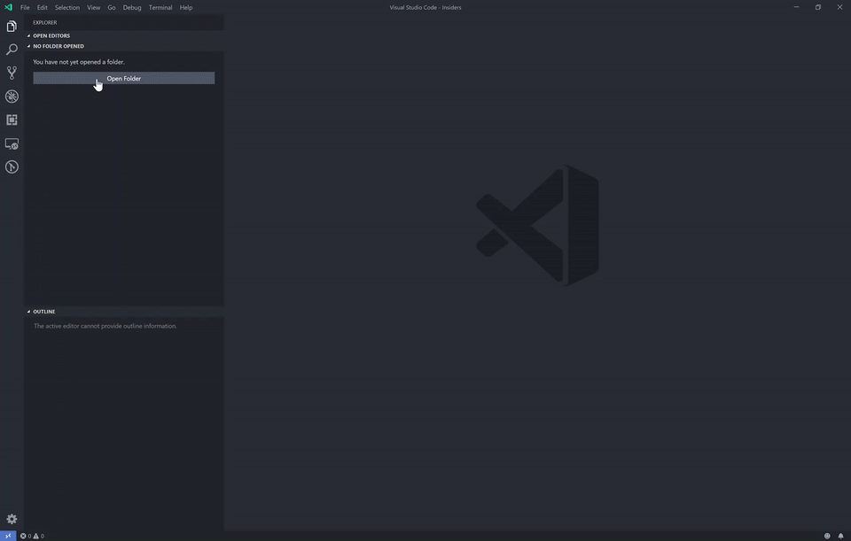
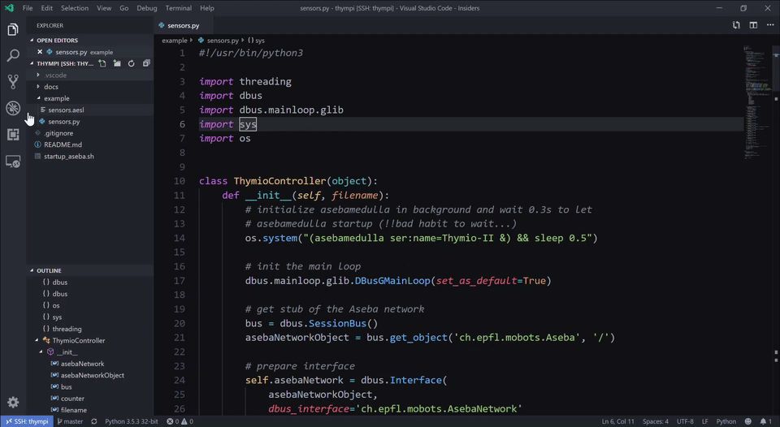

# Thympi

<p align="center">
  <a href="#"></a>
</p>

- [Setup Raspberry Pi](#setup-raspberry-pi)
- [Setup development environment](#setup-development-environment)
- [Asebamedulla](#asebamedulla)
    - [Talk with thymio](#talk-with-thymio)
    - [API-Docs](docs/API.md)
        - [Sensors](docs/API.md#sensors)
        - [Commands to control actuators](docs/API.md#commands-to-control-actuators)
- [Run python scripts](#run-python-scripts)
- [Example](#example)

# Setup Raspberry Pi

1. Download [raspbian .zip](https://www.raspberrypi.org/downloads/raspbian/) and follow the instructions to flash to `.img` to an sd card
2. initial setup over screen
    - setup ssh: `sudo systemctl enable ssh && sudo systemctl start ssh`
3. Copy the aseba: Copy `aseba_1.5.5_armhf.deb` to `/home/pi` (if there is a newer build,download it from [here](http://wiki.thymio.org/en:linuxinstall))
4. put the sd card in the raspberry pi, boot it up. Make sure your raspberry is connected via ethernet to your local network.
5. ssh to your pi : `ssh pi@<local-ip-address-of-pi>`, the default raspbian password is `raspberry`
6. install aseba and it's dependencies:
    - `sudo dpkg -i aseba_1.5.5_armhf.deb`
    - `sudo apt-get update && sudo apt-get -f install`
    ```sh
    sudo apt-get update
    sudo apt-get upgrade
    sudo apt-get install --no-install-recommends xserver-xorg
    sudo apt-get install --no-install-recommends xinit
    sudo apt-get install raspberrypi-ui-mods
    sudo apt-get install --no-install-recommends raspberrypi-ui-mods lxterminal gvfs
    sudo apt-get install rc-gui
    ```
    - `sudo apt-get install python-dbus` (dbus)
    - `sudo apt-get install python-gtk2` (glib)
    - 
7. connect to the local wifi: run `sudo raspi-config`, go to *Network Options* and follow instructions.
8. disconnect the ethernet and ssh over wifi to the pi (new ip address). To get all ip addresses of connected network devices, use either
    - the userinterface of your router. Visit the local ip address of your network with a browser, usually it is `192.168.1.1`. Usually there you'll find an option to show all connected network devices and it's ip's. 
    - or use `nmap` in a shell:
        ```sh
        nmap -sn 192.168.1.1-254/24 | egrep "scan report" | awk '{print $6 " -> " $5}'
        ```
        (you may need to install it with `sudo apt-get install nmap`)


9. Connect the pi with thymio over a micro-usb cable
10. list connected devices on raspberry pi with `lsusb` in the ssh-console and check if the thymio is listed
    - Look for `Swiss Federal Insitute of Technology` (yes, there is a typo...)

The Setup is done, now we can start to code

# Setup development environment

[VS Code Insiders](https://code.visualstudio.com/insiders/) provides an easy way to develop and even debug directly on the raspberry pi. Download and install vs code locally on your machine. Open it and install the following extension locally:
- [Remote - SSH (Nightly)](https://marketplace.visualstudio.com/items?itemName=ms-vscode-remote.remote-ssh-nightly)

Then connect over the `Remote-SSH`-Panel to your raspberry pi. The easyiest way is to configure a new connection file - once created, you can open remote vs code directly.

<p align="center">
  <a href="#"></a>
</p>

Additionally, when you add your ssh pubkey to `~/.ssh/authorized_keys`, you will not be prompted for password when connecting.

## Asebamedulla

Asebamedulla provides dbus bindings which can be accessed by any programming language. To get ready to talk to asebamedulla, we must first start it: `asebamedulla ser:name=Thymio-II`. To ensure that asebamedulla is running, we can call the above `shell` command over python with an os call:

```py
import os
# initialize asebamedulla in background and wait 0.3s to let
# asebamedulla startup
os.system("(asebamedulla ser:name=Thymio-II &) && sleep 0.3")        
```

This will startup a background process, bound to the current shell (is killed when the remote session gets closed). Note that there is a fix timeout of `0.3s` for asebamedulla to startup. This is normally enough time - you may have to increase the timeout for older raspberry pi's or slower sd cards.

- show running asebamedulla daemons, run `ps afux | grep asebamedulla`
- stop asebamedulla, run `pkill -n asebamedulla`.


### Talk with thymio

With python we can easily use the DBUS over the `dbus` package:

```py
import dbus
import dbus.mainloop.glib

# init the dbus main loop
dbus.mainloop.glib.DBusGMainLoop(set_as_default=True)

# get stub of the aseba network
bus = dbus.SessionBus()
asebaNetworkObject = bus.get_object('ch.epfl.mobots.Aseba', '/')

# prepare interface
asebaNetwork = dbus.Interface(
    asebaNetworkObject,
    dbus_interface='ch.epfl.mobots.AsebaNetwork'
)

# load the file which is run on the thymio
asebaNetwork.LoadScripts(
    'path/to/thympi.aesl',
    reply_handler=self.dbusReply,
    error_handler=self.dbusError
)
```
In the code above an `.aesl` file is sent over the dbus to the thymio. This file must define the translation of dbus events sent from python to the action performed on the thymio. The `example/thympi.aesl` defines all standard events to control thymio's actuators.

See the [API Docs](docs/API.md) for available commands to access thymio's actuators and sensors.

Example to read the accelerator sensor values:

```py
acc = asebaNetwork.GetVariable('thymio-II', 'acc')
x = acc[0]
y = acc[1]
z = acc[2]
```

Example to set motor speed:

```py
left_wheel = 20
right_wheel = 200
self.asebaNetwork.SendEventName(
    'motor.target',
    [left_wheel, right_wheel]
)
```

**Note** all values received and passed to dbus are arrays - even for single values!

## Run python scripts

You can run your python 3 scripts over the terminal:
```sh
python3 ./example/thympi.py ./example/thympi.aesl
```

Or you can install the [Python]() plugin on the remote vs code, and then run and debug (visual breakpoints and state inspection are built in) the python scripts with `F5`. You have to configure launch file to run the local python file. To pass in the `.aesl` file as an argument, add `"args": ["${fileDirname}/thympi.aesl"]`. This expects that the `.aesl` file (`thympi.aesl`) is at the same location as the running python file. (You can change the location of `thympi.aesl` to e.g. the root folder and specify then `"args": ["${workspaceFolder}}/thympi.aesl"]`).


<p align="center">
  <a href="#"></a>
</p>

# Example

The example uses a class `ThymioController` which initializes asebamedulla, configures the dbus and as the main part contains a method `main_loop` which is called all `20ms`. The example prints out all readed sensor values and sends some data to thymios actuators. The [example folder](./example) contains two files, [thympi.aesl](./example/thympi.aesl) configures thymio to react on dbus events corrctly (for actuator control), [thympi.py](./example/thympi.py) is the python3 script to run the demo.