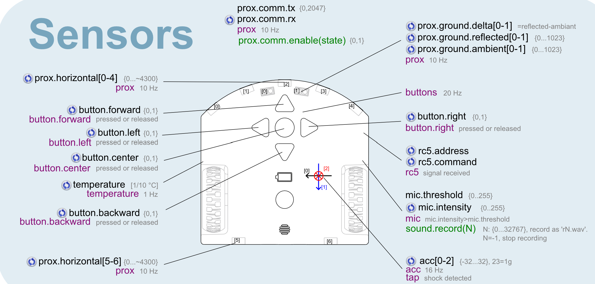
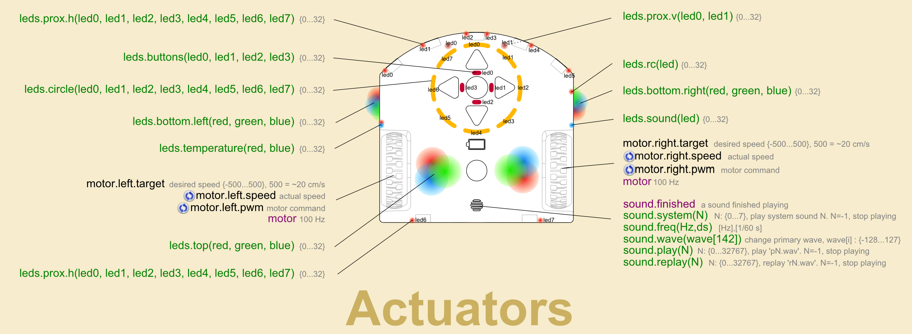

# Thymio actuators and sensors
- [Sensors](#sensors)
- [Commands to control actuators](#commands-to-control-actuators)

Following commands are accessbile with `sensors.py` + `sensors.aesl`

## Sensors

Note: all values (even single ones) must are returned as an array.

| event name            | values    | range     | unit/notes                      |
|:----------------------|----------:|----------:|--------------------------------:|
|`acc`                  |          3| `-32..+32`| `32=1g`                         |
|`button.backward`      |          1|`0,1`      |                                 |
|`button.center`        |          1|`0,1`      |                                 |
|`button.forward`       |          1|`0,1`      |                                 |
|`button.left`          |          1|`0,1`      |                                 |
|`button.right`         |          1|`0,1`      |                                 |
|`mic.intensity`        |          1|`{0..255}` |                                 |
|`prox.comm.rx`         |          1|           |                                 |
|`prox.ground.delta`    |          2|           | reflected ambiant               |
|`prox.ground.reflected`|          2|`0..1023`  |                                 |
|`prox.ground.ambiant`  |          2|`0..1023`  |                                 |
|`prox.horizontal`      |          7|`0..~4300` |                                 |
|`temperature`          |          1|           | `°C`, sampling rate `1/10 Hz`   |

  

## Commands to control actuators

Note: all arguments (even single ones) must be passed as an array.

| command           | arguments | range     | unit/notes                    |
|:------------------|----------:|----------:|------------------------------:|
|`leds.bottom.left` |          3|`0..32`    | rgb color                     |
|`leds.bottom.right`|          3|`0..32`    | rgb color                     |
|`leds.buttons`     |          4|`0..32`    | rgb color                     |
|`leds.circle`      |          8|`0..32`    | rgb color                     |
|`leds.color`       |          3|`0..32`    | rgb color for top, left, right|
|`leds.prox.h`      |          8|`0..32`    | rgb color                     |
|`leds.prox.v`      |          2|`0..32`    | rgb color                     |
|`leds.rc`          |          1|`0..32`    | rgb color                     |
|`leds.sound`       |          1|`0..32`    | rgb color                     |
|`leds.temperature` |          2|`0..32`    | rgb color                     |
|`leds.top`         |          3|`0..32`    | rgb color                     |
|`mic.threshold`    |          1|           |                               |
|`motor.target`     |          2|`-500..500`|`500 ~= 20cm/s`, [Left, Right] |
|`prox.comm.tx`     |          1|`0..2047`  |                               |
|`prox.comm.enable` |          1|`0, 1`     |                               |
|`sound.system`     |          1|`0..7`     |`-1` --> stop playing          |
|`sound.freq`       |          2|           |`[Hz, 1/60s]`                  |
|`sound.play`       |          1|`0..32767` |`-1` --> stop playing          |
|`sound.replay`     |          1|`0..32767` |`-1` --> stop playing          |
|`timer0.period`    |          1|           |`ms`                           |
|`timer1.period`    |          1|           |`ms`                           |

  

